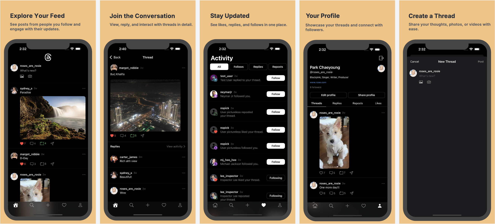
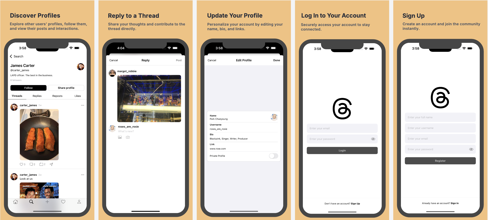

# Nexus iOS App

Nexus is a modern iOS social media application developed in Swift using SwiftUI, inspired by platforms like Twitter and Threads. It empowers users to post updates (text + images), follow others, like and comment on posts, and receive real-time notifications. The app uses Firebase for backend infrastructure, enabling real-time sync and secure user authentication.

---

## 📜 Table of Contents
- [Screenshots](#-screenshots)
- [Features](#-features)
- [Technologies Used](#-technologies-used)
- [Installation](#-installation)
- [Usage](#-usage)
- [Credits](#-credits)
- [License](#-license)

---

## 📷 Screenshots



---

## 🚀 Features

- 📝 Create posts with text and images.
- 👥 Follow/unfollow users and view their updates in your feed.
- ❤️ Like and 💬 comment on posts to engage with the community.
- 🔔 Receive real-time push notifications via Firebase Cloud Messaging (FCM).
- 👤 Manage your profile (username, bio, profile picture).
- 🌓 Support for both Light and Dark mode.
- 🔒 Secure Firebase Authentication for sign-up and sign-in.
- 🗨️ **Coming Soon**: Direct messaging between users for private conversations.

---

## 🧰 Tech Stack

**Swift & SwiftUI** – Declarative UI framework for building native, responsive interfaces.

**Firebase (Google Cloud Platform):**

- 🔐 Firebase Authentication – Email/password and anonymous auth.
- 🔄 Cloud Firestore – Real-time NoSQL database.
- ☁️ Firebase Storage – Media and profile picture storage.
- 📡 Firebase Cloud Messaging – Push notifications.

---

## 📥 Installation

1. Clone the repository:
    ```bash
    git clone https://github.com/your-username/nexus-ios.git
    ```

2. Navigate to the project directory:
    ```bash
    cd nexus-ios
    ```

3. Open the project in Xcode:
    ```bash
    open Nexus.xcworkspace
    ```

4. Install project dependencies using **CocoaPods** (if applicable):
    ```bash
    pod install
    ```

5. Set up **Firebase**:
   - Create a Firebase project and add an iOS app.
   - Download the `GoogleService-Info.plist` from Firebase and add it to your project.
   - Enable **Firestore** and **Authentication** in the Firebase Console.

6. Build and run the project:
    ```bash
    cmd + R
    ```

---

## 💻 Usage

- Sign up or log in using Firebase Authentication.
- Post updates to your timeline, follow users, and interact with posts.
- Check notifications for real-time updates on likes, comments, and new followers.
- Access your profile to manage account details and upload a profile picture.

---

## 👨‍💻 Credits

This project was developed by **Binaya Thapa Magar**:  
- [**Binaya Thapa Magar**](https://github.com/binayathapamagar)

---

## 📄 License

This project is licensed under the MIT License – see the [LICENSE](LICENSE) file for details.

---

### 📬 Contact

For inquiries or feedback, feel free to reach out to me via GitHub or [your preferred contact method].
